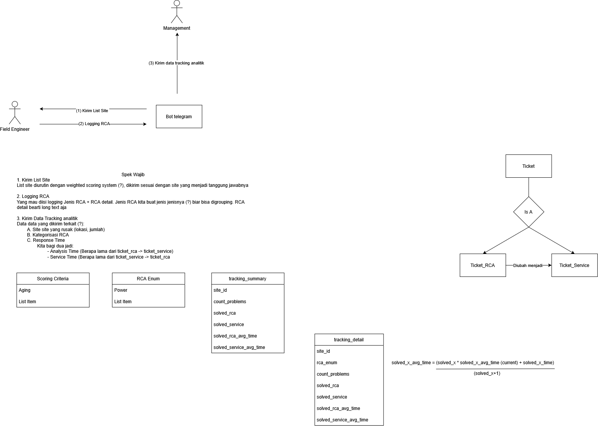

# Menjalankan Backend dan Bot Telegram

Panduan ini menjalankan backend FastAPI serta bot Telegram secara lokal di
Windows/PowerShell. Bot membaca tiket dari backend dan command
`/notify_engineers` mengirim lima tiket mock ke masing-masing engineer:
`8887960178` dan `8510386982`.

## 1. Siapkan Python environment

Dari folder root repository, buat virtual environment (cukup sekali):

```powershell
py -m venv .venv
.\.venv\Scripts\Activate.ps1
pip install -r .\backend\requirements.txt
pip install -r .\frontend\TelegramBotRCA\requirements.txt
```

Jika PowerShell menolak `Activate.ps1`, jalankan sekali pada terminal tersebut:

```powershell
Set-ExecutionPolicy -Scope Process -ExecutionPolicy Bypass
```

## 2. Konfigurasi bot

Salin contoh konfigurasi lalu isi token bot yang aktif dari BotFather:

```powershell
Copy-Item .\frontend\TelegramBotRCA\.env.example .\frontend\TelegramBotRCA\.env
```

Isi `frontend/TelegramBotRCA/.env` seperti berikut:

```env
TELEGRAM_BOT_TOKEN=token_baru_dari_botfather
API_BASE_URL=http://127.0.0.1:8000/api
ENGINEER_DISTRICT=DISTRICT-8887960178
```

`ENGINEER_DISTRICT` dipakai untuk menu **View Ticket** pada bot. Untuk uji
notifikasi mock, pembagian tiket tidak bergantung pada nilai ini.

> Jangan commit file `.env` atau membagikan token bot. Bila token pernah
> tersimpan di source code, buat token baru melalui BotFather sebelum menjalankan bot.

## 3. Jalankan backend

Buka terminal pertama dari root repository dan aktifkan environment bila belum:

```powershell
.\.venv\Scripts\Activate.ps1
Set-Location .\backend
uvicorn api:app --reload
```

Backend tersedia pada `http://127.0.0.1:8000`; dokumentasi endpoint ada di
`http://127.0.0.1:8000/docs`.

Untuk memastikan data mock tersedia, dari terminal lain jalankan:

```powershell
Invoke-RestMethod http://127.0.0.1:8000/api/engineers
Invoke-RestMethod http://127.0.0.1:8000/api/mock/engineers/8887960178/tickets
```

## 4. Jalankan bot

Buka terminal kedua dari root repository:

```powershell
.\.venv\Scripts\Activate.ps1
Set-Location .\frontend\TelegramBotRCA
python .\main.py
```

Biarkan kedua terminal tetap berjalan selama pengujian.

## 5. Mulai chat dengan bot di Telegram

1. Di Telegram, cari username bot yang dibuat melalui **@BotFather**, atau buka
   tautan `https://t.me/<username_bot>`.
2. Buka chat bot lalu tekan **Start** atau kirim `/start` dari kedua akun
   engineer (`8887960178` dan `8510386982`). Ini wajib dilakukan sekali agar
   Telegram mengizinkan bot mengirim pesan ke mereka.
3. Dari chat bot mana pun, kirim `/notify_engineers`.
4. Kedua engineer akan menerima pesan penugasan berisi lima tiket mock. Mereka
   dapat memilih **Engineer Field** → **View Ticket** untuk melihat dan mengisi
   RCA pada tiket yang ditampilkan.

Jika hasil command menyatakan pesan gagal dikirim, pastikan ID Telegram itu
benar, akun tersebut sudah mengirim `/start`, dan `TELEGRAM_BOT_TOKEN` valid.
